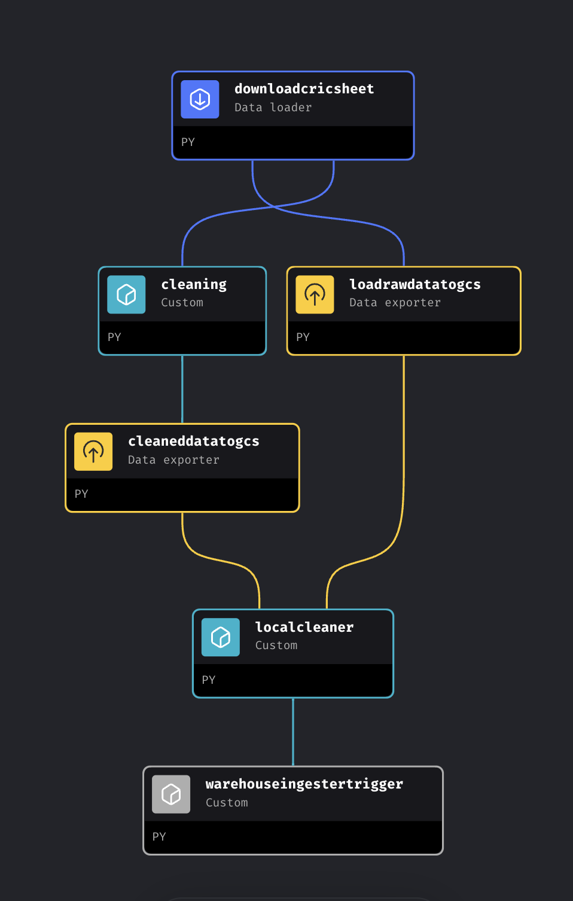
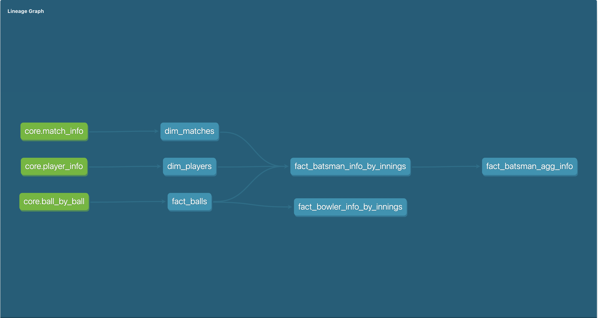
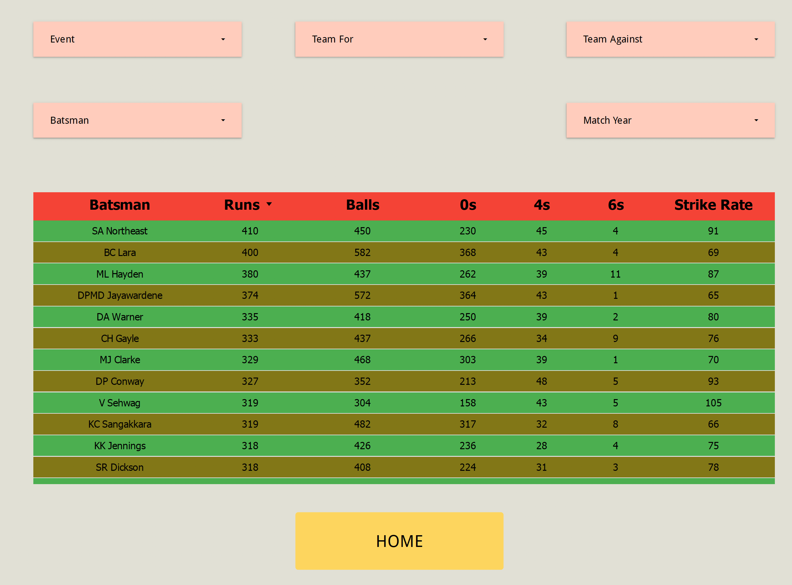
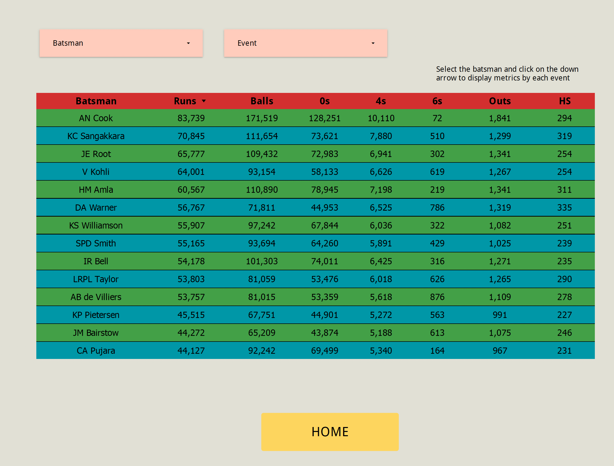
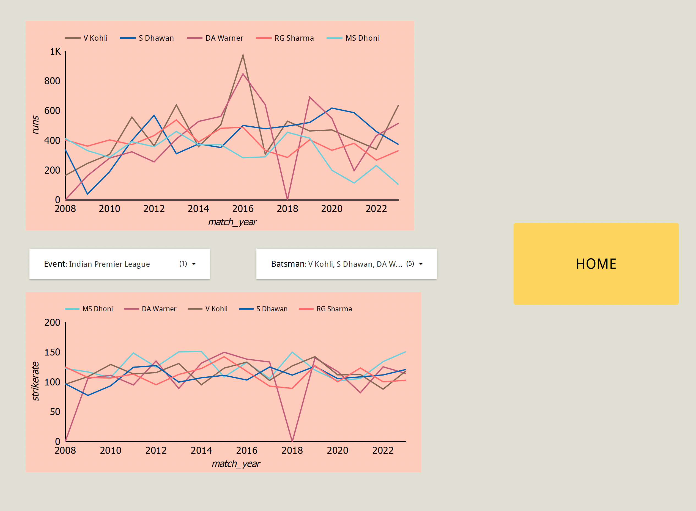

# StumpStory 

The Cricket Data Analytics Dashboard addresses the need for cricket enthusiasts to gain deeper insights into the game's dynamics. By providing a comprehensive web-based platform, users can explore, analyze, and visualize cricket data effortlessly. From match statistics to player performances and team dynamics, the dashboard offers valuable insights, empowering users to make informed decisions. Whether it's understanding match strategies, player strengths, or identifying trends for fantasy cricket team creation on platforms like Dream11, the dashboard serves as a vital tool for cricket enthusiasts to enhance their understanding and engagement with the sport.

## Architecture 0.2 

## Technology stacks used 

- Terraform - Infrastructure as Code (IaC)
- MageAI - Orchestration Tool
- dbt Cloud - Transformations
- GCP - Google cloud storage, Google cloud functions, BigQuery, Looker Studio

## Terraform 

The following are the terraform resources needed for the project [As of now]

1. GCP Bucket - To store the raw and staging data extracted from cricsheet.org before loading them to the data warehouse.
    UPDATE: Removed version since it lead to multiple unneccssary, duplicate files.
2. GCP Compute Engine - To have the Docker image of MageAI running for loading data from cricsheet.org.
3. GCP Static Address - A static public IP address connected to the VM to enable remote connection from the host.

## MageAI 

The Docker image of MageAI is running on the GCP VM with a cron job scheduled to perform a daily full data load from cricsheet.org at 00:00. It loads the raw data under a folder called "raw/" and performs some initial cleaning of the CSVs before loading them by match_info, player_info, and ball_by_ball information to staging/

## dbt Cloud

Constructed a basic dimensional modelling structure from the available data, has dimension tables for players and match info. and the grain will be each ball bowled in a cricket match

## Looker Studio

https://lookerstudio.google.com/s/h4uKBKk1PXY

 

 

## DESIGN CHOICES: 
     - Doing a full historical load every day since the data is small as of now. Doing a full historical load also frees me from doing backfills in case there are any errors in the data.
     - Made use of Dask for parallel uploading files to GCP which drastically reduced the pipeline runtime from 2.5 hours to 30 minutes.
     - The data in BigQuery tables has not been partitioned becasue there are not relevant columns to partition the data on.
     - Added a google cloud function to send the data from GCP cloud storage to BigQuery.

## Steps to Run

1.  Set up Google Cloud Platform (GCP) Account:

    -   Create a GCP account if you haven't already.
    -   Generate a service account key with admin privileges and save the JSON file.

2.  Clone the Repository

3.  Modify Terraform Configuration:

    -   Navigate to the project directory.
    -   Open `main.tf` and update the `credentials` field with the path to your service account JSON file.
4.  Apply Terraform Configuration:

    -   Run Terraform to create necessary resources in GCP.

    `terraform init
    terraform apply`

5.  Set up MageAI Docker Container:

    -   SSH into the GCP VM created by Terraform.
    -   Clone the repository again within the VM.
    -   Navigate to the repository directory.
    -   Start the Docker containers using Docker Compose.

    `docker-compose up -d`

6.  Run Raw Data Ingester and Cleaner:

    -   Manually run the `rawdataingesterandcleaner` script or set it up as a scheduled job.
    -   This script cleans and uploads raw data files to the GCP bucket. It's scheduled to run daily at 00:00 CST.
    -   This script also invokes the trigger for running the function which ingests data from GCP bucket to BigQuery.

7.  Set up dbt Cloud Account:

    -   Create a dbt Cloud account if you don't have one.
    -   Copy all files from the dbt module to your dbt Cloud account to create required fact and dimension tables.

8.  Explore Data with Looker Studio:

    -   Visit the provided Looker Studio link to explore analytical charts and insights generated from the data.