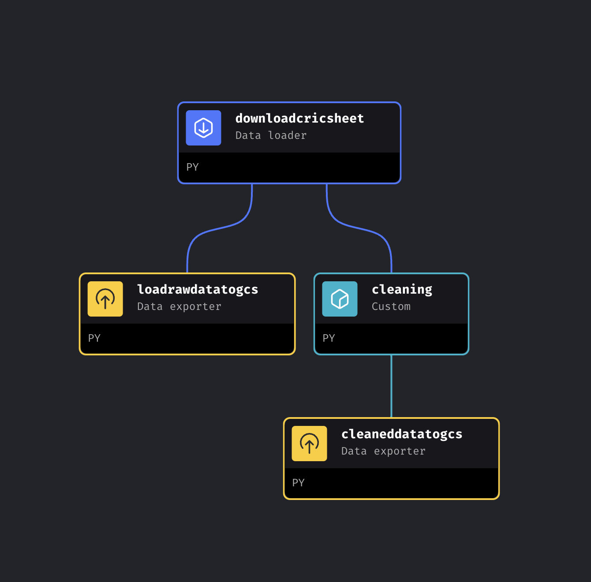
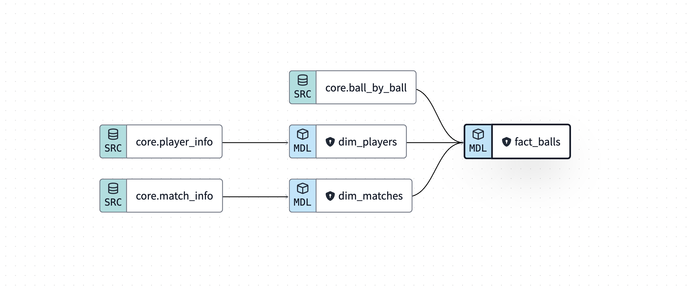

# StumpStory 

The Cricket Data Analytics Dashboard is a web-based application designed to provide cricket enthusiasts with powerful tools to explore, analyze, and visualize cricket data. The dashboard aims to assist users in understanding cricket matches, players, teams, and various statistical metrics, ultimately helping them make informed decisions, such as creating fantasy cricket teams for platforms like Dream11.

## Architecture V0.1 

The project follows the medallion architecture style of bronze, silver, and gold for raw, staging, and transformed data.

## Technology stacks used 

- Terraform - Infrastructure as Code (IaC)
- MageAI - Orchestration Tool
- dbt - Transformations
- Looker Studio - Analytical Charts

## Terraform 

The following are the terraform resources needed for the project [As of now]

1. GCP Bucket - To store the raw and staging data extracted from cricsheet.org before loading them to the data warehouse.
    UPDATE: Removed version since it lead to multiple unneccssary, duplicate files.
2. GCP Compute Engine - To have the Docker image of MageAI running for loading data from cricsheet.org.
3. GCP Static Address - A static public IP address connected to the VM to enable remote connection from the host.

## MageAI 

The Docker image of MageAI is running on the GCP VM with a cron job scheduled to perform a daily full data load from cricsheet.org at 00:00. It loads the raw data under a folder called "raw/" and performs some initial cleaning of the CSVs before loading them by match_info, player_info, and ball_by_ball information to staging/
    
    DESIGN CHOICES: 
        - Doing a full historical load every day since the data is small as of now. Doing a full historical load also frees me from doing backfills in case there are any errors in the data.
        - Made use of Dask for parallel uploading files to GCP which drastically reduced the pipeline runtime from 2.5 hours to 30 minutes

## dbt

Constructed a basic dimensional modelling structure from the available data, has dimension tables for players and match info. and the grain will be each ball bowled in a cricket match

## Looker Studio

https://lookerstudio.google.com/s/h4uKBKk1PXY